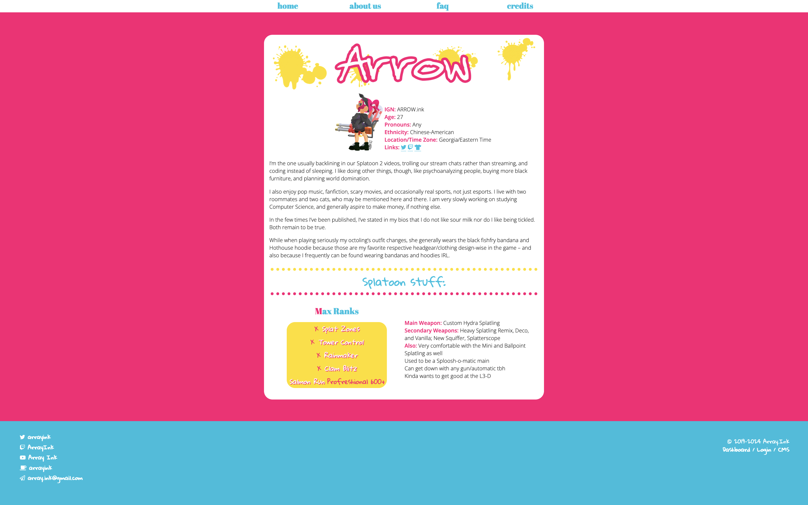

# Array Ink
Array Ink was a collaborative project with me and my friend Rae, in our attempts to become video game Youtubers and streamers in our spare time. As neither of us have really worked on it or cared to work on it for years since we originated this idea (2018), the project has now been retired.

This website would have functioned as the website for any sort of ambitious web project like this&mdash;as a centralized "about" space that we could direct people to. Actually, when we started it, we couldn't even own the URL yet at the time&mdash;I snagged it months later when I saw that it was available. Now, it will return to the ether of the internet. But Array Ink's design will forever live in my heart. And on Github.

I did not import just the theme though, as I think keeping track of the plugins I had used to make this run-on-Wordpress website operate the way that it did quite fun. There are graphics (that I made), art (that we commissioned), no blog posts, and a lightweight amount of information. It's Splatoon themed, because we really bonded over Splatoon 2 shortly after it came out, so it made sense. There was virtually very little traffic, but I think the fact that I started our FAQ with "Are you dating?" (No.) is probably the funniest thing about the website.

It was retired in November 2024.

# Pages

- Home
- About Us
	- Arrow
	- Rae
- FAQ
- Credits

# Gallery

